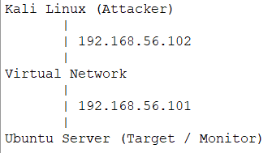
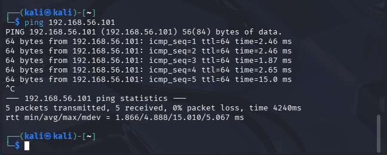
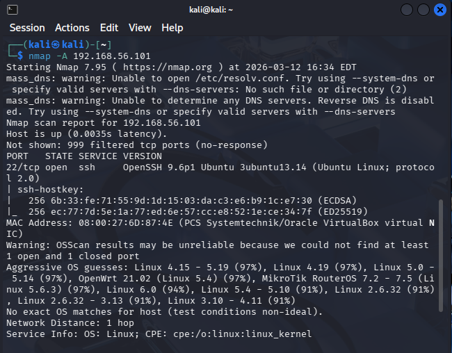
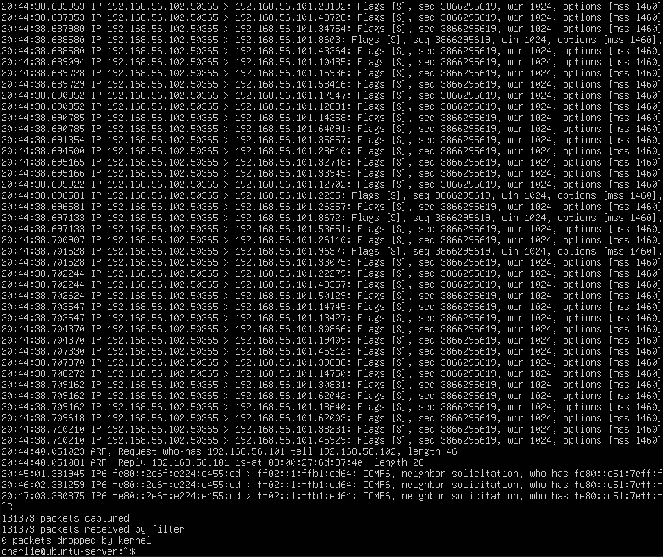

# Virtual SOC Cybersecurity Lab

This project demonstrates a virtual cybersecurity lab designed to simulate network reconnaissance and monitor suspicious network activity. The environment uses Kali Linux as the attacker machine and Ubuntu Server as the monitored target system.

---

## Lab Architecture

The lab environment consists of two virtual machines connected through a VirtualBox host-only network.

| Machine | Role | IP Address |
|-------|------|-----------|
| Kali Linux | Attacker | 192.168.56.102 |
| Ubuntu Server | Target / Monitoring | 192.168.56.101 |

---

## Step 1 – Network Connectivity Verification

Before performing reconnaissance, connectivity between the attacker and target machines was verified using an ICMP ping test.

Command used:ping 192.168.56.101

---

## Step 2 – Baseline Network Reconnaissance Scan

A reconnaissance scan was conducted using Nmap to identify open ports and running services on the Ubuntu server.

Command used: nmap -A 192.168.56.101

This scan identifies:

- Open ports
- Running services
- Service versions
- Basic host information

---

## Step 3 – Monitoring Network Traffic

While the Nmap scan was executed, network traffic was monitored on the Ubuntu server using tcpdump.

Command used: sudo tcpdump -i enp0s3 -n

---

## Security Findings

The Nmap scan identified exposed services on the Ubuntu server. Packet monitoring confirmed that reconnaissance traffic originating from the Kali Linux attacker machine could be detected through network monitoring tools such as tcpdump.

This demonstrates how security analysts can observe and analyze suspicious network activity during the reconnaissance stage of an attack.

---

## Tools Used

- Kali Linux
- Ubuntu Server
- VirtualBox
- Nmap
- tcpdump

---

## Skills Demonstrated

- Virtual machine networking
- Linux command line administration
- Network reconnaissance
- Packet capture and monitoring
- Basic cybersecurity analysis
